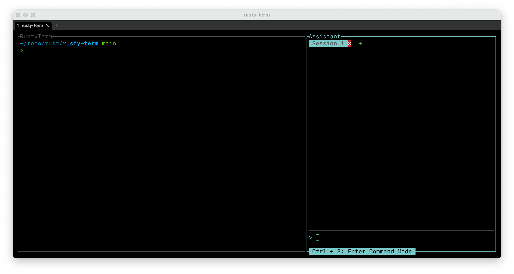
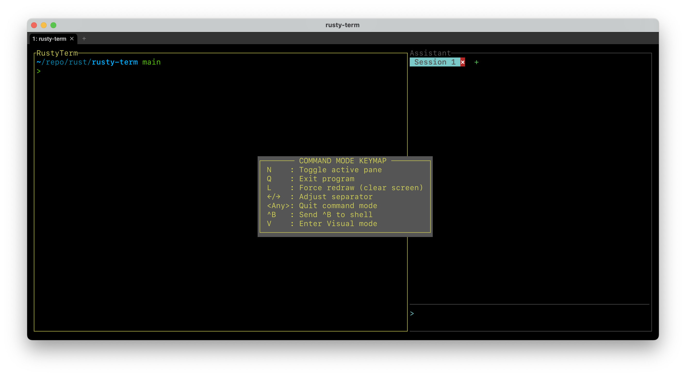
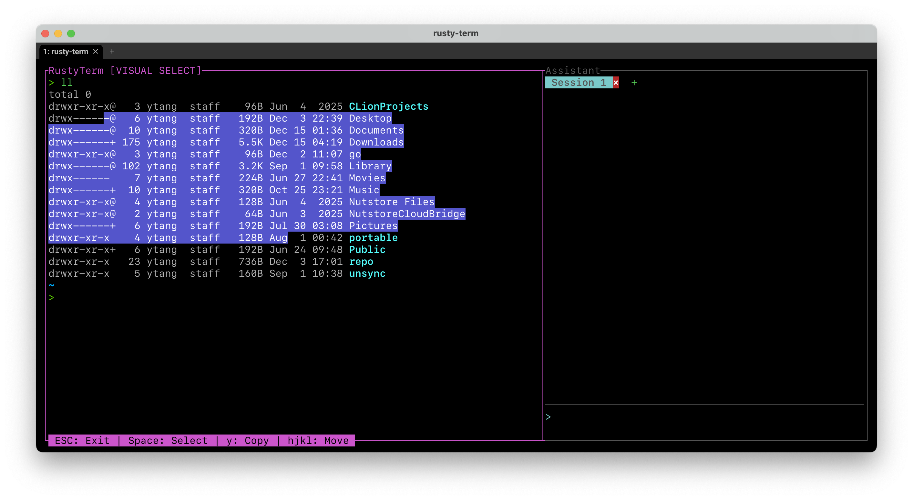
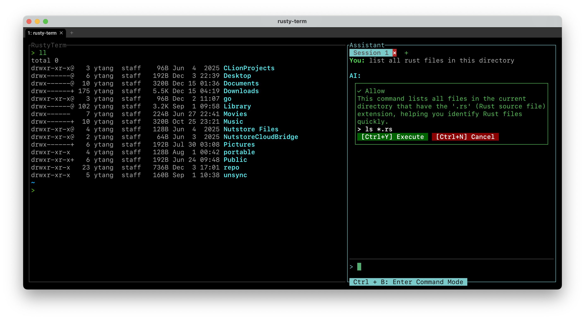

# RustyTerm: Rust-Based AI Copilot for the Command Line

## **Team Information**


| Member      | Student Number | Email                        |
|-------------|----------------|------------------------------|
| Weijie Zhu  | 1009310906     | weijie.zhu@mail.utoronto.ca  |
| Irys Zhang  | 1012794424     | irys.zhang@mail.utoronto.ca  |
| Yushun Tang | 1011561962     | yushun.tang@mail.utoronto.ca |

---

## Reproducibility Guide

This section provides step-by-step instructions to set up the runtime environment and build the project.

### System Requirements

| Requirement | Details |
|-------------|---------|
| Operating System | Unix-like systems only (macOS, Linux). **Windows is NOT supported.** |
| Rust Version | 1.90 or later |
| Shell | zsh (tested and recommended), bash (should work but untested) |
| OpenAI API Key | Required for AI assistant functionality |

### Step 1: Install Rust Toolchain

If you don't have Rust installed, install it via rustup:

```bash
curl --proto '=https' --tlsv1.2 -sSf https://sh.rustup.rs | sh
```

After installation, ensure your Rust version is 1.90 or later:

```bash
rustc --version
# Expected output: rustc 1.90.0 or higher
```

### Step 2: Clone the Repository

```bash
git clone https://github.com/user/rtdbg.git
cd rtdbg
```

### Step 3: Set Up OpenAI API Key

RustyTerm requires an OpenAI API key to enable AI assistant functionality. Set the environment variable:

```bash
export OPENAI_API_KEY="your-api-key-here"
```

If you want to make this persistent, add the export command to your shell configuration file (`~/.zshrc` for zsh or `~/.bashrc` for bash).

### Step 4: Build and Run

Build and run the application in release mode for optimal performance:

```bash
cargo run --release
```

### Troubleshooting

| Issue | Solution |
|-------|----------|
| `OPENAI_API_KEY not set` error | Ensure the environment variable is exported in your current shell session |
| Build fails with Rust version error | Update Rust: `rustup update` |
| Terminal display issues | Ensure your terminal supports 256 colors and has sufficient size (minimum 80x24) |

---

## User's Guide

This section explains how to use each of the main features in RustyTerm.

### Interface Overview

RustyTerm provides a split-screen TUI (Text User Interface) with two panes:




- **Terminal Panel (Left)**: A fully functional shell session where you can execute commands directly
- **Assistant Panel (Right)**: AI-powered chat interface for natural language queries and command suggestions

The border of active pane is highlighted.

### Keyboard Shortcuts

RustyTerm uses a command mode system (similar to tmux or vim) for navigation and control.

#### Command Mode

Press `Ctrl+B` to enter command mode. While in command mode, the available keyboard shortcuts are displayed.




#### Normal Mode (Terminal Panel)

When the Terminal panel is active, all keyboard input except for `Ctrl + B` is sent directly to the shell, just like a regular terminal.

To send `Ctrl + B` to shell, use `Ctrl + B` `Ctrl + B`.

#### Normal Mode (Assistant Panel)

When the Assistant panel is active, the behavior is mostly like interacting with an input box, with a few exceptions:

| Key | Action |
|-----|--------|
| `Enter` | Send query to the AI |
| `Ctrl + O` | Insert newline (for multi-line input) |
| `Tab` | Switch to next AI session |
| `Ctrl + Y` | Execute (or copy if denied by ) the suggested command |
| `Ctrl + N` | Reject command suggestions |
| `Ctrl + A` | Cycle to next command suggestion (if there are more than one suggestions) |

#### Scrolling

Both panels support scrollback.

| Key | Action |
|-----|--------|
| `Shift + Up/Down` | Scroll one line |
| `Shift + PageUp/PageDown` | Scroll 10 lines |
| `Shift + End` | Scroll to bottom |
| `Esc` | Exit scroll mode (Assistant only) |

#### Visual Mode

Enter visual mode by pressing `Ctrl + B` then `V`. Visual mode allows cursor-based navigation and text selection (vim-style).

| Key | Action |
|-----|--------|
| `h/j/k/l` or Arrow keys | Move cursor |
| `Space` | Cycle selection mode: None → Line → Block |
| `y` | Copy selected text |
| `Shift + Up/Down` | Scroll without moving cursor |
| `PageUp/PageDown` | Scroll 10 lines |
| `1-9` | Repeat count prefix (e.g., `5j` moves down 5 lines) |
| `Esc` | Clear selection, or exit visual mode if no selection |



### Using the AI Assistant

#### Step 1: Ask a Question

Switch to the Assistant panel. Type your question in natural language. For example:

- "list all rust files in this directory"
- "find files larger than 10MB"
- "show git commit history"
- "check disk usage"

Press `Enter` to send your query.

#### Step 3: Review the AI Response

The AI will respond with:
- A natural language response
- Or, a **Command Card** containing the suggested shell command if requested to generate a command.

The Command Card displays:
- The suggested command
- A brief explanation
- A Security Verdict
- Action buttons

#### Step 4: Confirm or Reject

- Press `Ctrl+Y` to accept the command. Low-risk commands will be injected directly into the terminal. High-risk commands will be copied to your clipboard.
- Press `Ctrl+N` to reject the suggestion.
- To request revisions, explanations, or other suggestions, simply type your follow-up. This will automatically reject any pending commands.



### Session Management

RustyTerm supports multiple AI conversation sessions, allowing you to maintain separate contexts for different tasks.

- **Create a new session**: In command mode (`Ctrl+B`), create a new session to start a fresh conversation.

- **Switching between sessions**: Press `Tab` to switch to the next session. Session tabs are displayed at the top of the Assistant panel.

- **Close a session**: Press `W` in command mode to close the current session. If it's the last session, it will be cleared instead of closed.

### Mouse Support

RustyTerm supports these mouse operations:

- **Click** to focus a pane
- **Click** on session tabs to create, close and switch sessions.
- **Drag the separator** between panes to resize them
- **Scroll** to navigate through terminal output or chat history
- **Double-click** to select a word
- **Triple-click** to select a line

Mouse events are forwarded to mouse-supported programs (e.g., vim) when the terminal panel is active.
